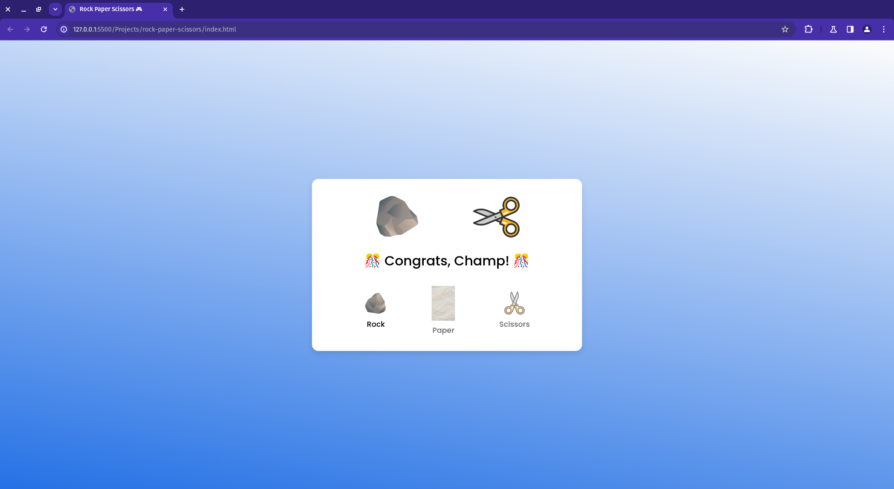

<h1>Rock Paper Scissors Game</h1>
  
  <section class="project-overview">
    <h2>Project Overview</h2>
    

      This repository contains a simple Rock Paper Scissors game built using HTML, CSS, and JavaScript. The game allows users to play against the computer and displays the results based on the classic rules of Rock Paper Scissors.
      The application is live and can be accessed at https://dark-programer.github.io/rock-paper-scissors-game
    

  </section>

  <section class="features">
    <h2>Features</h2>
    <ul>
      <li>Simple and intuitive user interface.</li>
      <li>Real-time result display based on user and computer selections.</li>
      <li>Visual feedback for user selections.</li>
    </ul>
  </section>

<h2>Technologies Used</h2>
<ul>
    <li>HTML</li>
    <li>CSS</li>
    <li>JavaScript</li>
</ul>

  <section class="usage">
    <h2>Usage</h2>
    

      Clone the repository to your local machine:
      <pre><code>git clone &lt;https://github.com/Dark-Programer/rock-paper-scissors-game.git&gt;</code></pre>
      Open the index.html file in your web browser to start playing the game.
    

  </section>

<h2>Screenshot</h2>

  
  
  
  

<h2>Author</h2>
    
Arka Chakraborty

<h2>Code Explanation</h2>
<h3>HTML Code</h3>
    

      The HTML code defines the structure of the game interface.
    

    <ul>
      <li>It includes a container section with two main parts: result-field and option-images.</li>
      <li>result-field contains two image elements to display the user's and computer's choices, as well as a div to show the result of the game.</li>
      <li>option-images contains three span elements, each representing one of the Rock, Paper, or Scissors options.</li>
    </ul>

<h3>JavaScript Code</h3>
    

      The JavaScript code handles the game's functionality.
    

    <ul>
      <li>It first selects the necessary DOM elements and stores them in variables.</li>
      <li>Event listeners are added to each option image. When an image is clicked, it triggers a series of actions:</li>
      <ul>
        <li>The clicked image is highlighted by adding an "active" class.</li>
        <li>The "active" class is removed from any other option images.</li>
        <li>A delay is added before showing the results.</li>
        <li>The user's selected image is displayed in the user result area.</li>
        <li>The user's guess is determined based on the selected image.</li>
        <li>A random value is generated for the computer's guess, and the corresponding image is displayed in the computer result area.</li>
        <li>The game result is determined based on the user's and computer's guesses using predefined outcomes.</li>
        <li>The result is displayed in the result div.</li>
      </ul>
    </ul>
